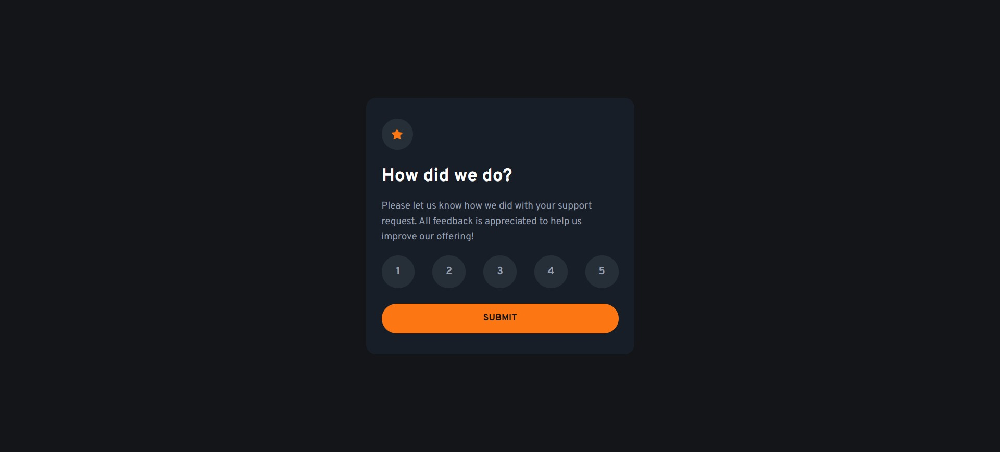

# Frontend Mentor - Interactive rating component solution

This is a solution to the [Interactive rating component challenge on Frontend Mentor](https://www.frontendmentor.io/challenges/interactive-rating-component-koxpeBUmI). Frontend Mentor challenges help you improve your coding skills by building realistic projects.

## Overview

### The challenge

Users should be able to:

- View the optimal layout for the app depending on their device's screen size
- See hover states for all interactive elements on the page
- Select and submit a number rating
- See the "Thank you" card state after submitting a rating

### Screenshot



### Links

- Solution URL: [https://github.com/runny-life/interactive-rating-component](https://github.com/runny-life/interactive-rating-component))
- Live Site URL: [Add live site URL here](https://runny-life.github.io/interactive-rating-component/)

## My process

### Built with

- Semantic HTML5 markup
- CSS custom properties
- Flexbox
- CSS Grid
- Mobile-first workflow
- Vanilla JavaScript (no frameworks)

### What I learned

Throughout this project, I strengthened the following skills:

**1. Component state management**

Using CSS classes to toggle between card states:

```css
.rating.is-hidden {
  visibility: hidden;
  scale: 0;
  opacity: 0;
  transition: opacity 0.3s, scale 0.3s, visibility 0s 0.3s;
}

.thank-you.is-visible {
  opacity: 1;
  visibility: visible;
  scale: 1;
  transition: opacity 0.3s, scale 0.3s;
}
```

**2. Rating selection handling**

Using the `aria-selected` attribute to track the chosen value:

```javascript
const onButtonClick = (e) => {
  buttonElements.forEach(button => {
    button.setAttribute("aria-selected", "false");
  })
  e.target.setAttribute("aria-selected", "true");
  selectedRating = e.target.textContent.trim();
}
```

**3. Responsive design with clamp()**

Using the `clamp()` function for responsive sizing:

```css
font-size: clamp(0.875rem, 0.815rem + 0.254vw, 0.938rem);
padding-block: clamp(1.5rem, 1.023rem + 2.036vw, 2rem);
```

### Continued development

In future projects, I want to focus on:

- Learning React for more efficient component state management
- Adding more complex transition animations
- Improving accessibility for users with disabilities

### Useful resources

- [CSS Clamp() Function](https://developer.mozilla.org/en-US/docs/Web/CSS/clamp) - Helped me create responsive typography
- [ARIA Authoring Practices Guide](https://www.w3.org/WAI/ARIA/apg/) - Used for proper accessibility configuration
- [Frontend Mentor Community](https://www.frontendmentor.io/community) - Source of inspiration and support

### AI Collaboration

AI tools were used during this project:

- **ChatGPT (DeepSeek)** - Assisted with:
  - Generating and refactoring JavaScript code for state management
  - Optimizing CSS styles and creating gradients
  - Reviewing HTML markup for accessibility
  - Finding solutions for transition animations
- What worked well: AI helped find optimal solutions faster and explained code principles
- What could be improved: Some suggestions required additional adaptation for the specific task

## Author

- GitHub - [@runny-life](https://github.com/runny-life)
- Frontend Mentor - [@runny-life](https://www.frontendmentor.io/profile/runny-life)

## Acknowledgments

Thanks to the Frontend Mentor community for providing materials and inspiration. Special thanks to all developers who share their solutions — it helps learn from others' mistakes and discover new approaches to implementation.